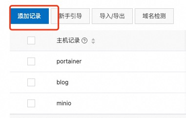
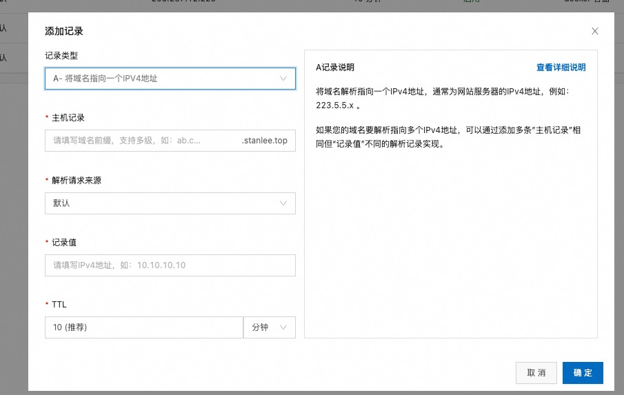

## 准备域名

首先我们需要去购买一个域名，可以去阿里云进行购买，购买的时候需要实名认证，然后等待域名解析，一般在十几分钟至个把小时。解析成功之后可以自己先测试一下是否解析成功能否通过DNS ping通，ping通之后就可以进行下一步了。


## 域名解析

我们以阿里云为例，购买成功之后就可以进行解析了，与服务器绑定。

进入控制台, 找到自己拥有的域名列表，找到需要解析的域名，点击:







`主机记录` 指的是子域名的名称, 默认的主域名是 `www.domain.com`, 而子域名就指的是 `blog.domain.com`,  我们先添加子域名 `blog` 作为博客地址。

`记录值` 指的是你拥有的 服务器的 ip地址，以后访问你的域名就会指向到该 ip地址的服务器。

其他的填默认内容就好，不做修改。

到此为止，我们就准备好了一个名为 `blog.domain.com` 的域名。

## nginx 配置

首先我们的前提条件是，我们已经通过`docker-compose`部署了一个nginx服务，并且可以通过服务器的ip以及对应的端口号进行访问。

如果想要通过域名去访问的话我们需要在服务器上起一个`nginx`服务，并通过反向代理的方式将通过域名访问的请求转发至服务器本机的服务地址。

假设主机的web服务端口是 `8080`, 那主机的访问地址就是 `http://127.0.0.1:8080`

当然需要在主机安装 `nginx`， 安装完成之后 执行：

```shell
nginx -t

nginx: the configuration file /etc/nginx/nginx.conf syntax is ok
nginx: configuration file /etc/nginx/nginx.conf test is successful
```

可以找到默认的`nginx` 默认的配置文件 `/etc/nginx/nginx.conf`

本说明基于`nginx 1.26.1`, 所以它的默认配置文件拆分在 `/etc/nginx/conf.d/default.conf` 文件中

修改 `/etc/nginx/conf.d/default.conf` 文件内容

```conf
server {
    listen 80;
    # 输入自己刚才解析的域名地址
    server_name blog.domain.com;

    location / {
        # 讲访问转发到主机部署的服务地址
        proxy_pass http://127.0.0.1:8080;
        proxy_set_header Host $host;
        proxy_set_header X-Real-IP $remote_addr;
        proxy_set_header X-Forwarded-For $proxy_add_x_forwarded_for;
    }
}

```

也就是将通过域名访问的请求转发至本机部署的服务地址上, 至此即可通过 `blog.domain.com` 域名访问到自己部署的 web 服务
