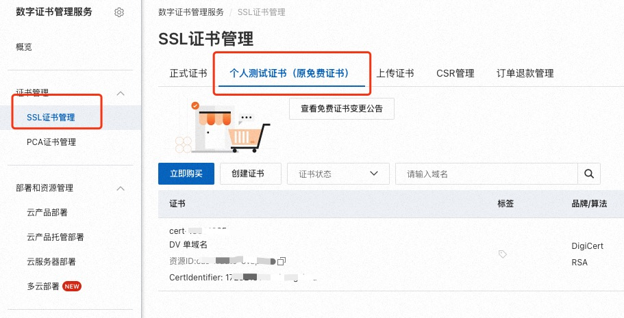
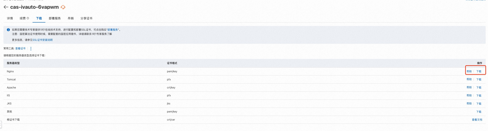

##  一、准备工作

1. 检查 安装的nginx是否支持ssl

```shell
nginx -V

nginx version: nginx/1.26.1
built by gcc 4.8.5 20150623 (Red Hat 4.8.5-44) (GCC)
built with OpenSSL 1.0.2k-fips  26 Jan 2017
TLS SNI support enabled
configure arguments: --prefix=/etc/nginx --sbin-path=/usr/sbin/nginx --modules-path=/usr/lib64/nginx/modules --conf-path=/etc/nginx/nginx.conf --error-log-path=/var/log/nginx/error.log --http-log-path=/var/log/nginx/access.log --pid-path=/var/run/nginx.pid --lock-path=/var/run/nginx.lock --http-client-body-temp-path=/var/cache/nginx/client_temp --http-proxy-temp-path=/var/cache/nginx/proxy_temp --http-fastcgi-temp-path=/var/cache/nginx/fastcgi_temp --http-uwsgi-temp-path=/var/cache/nginx/uwsgi_temp --http-scgi-temp-path=/var/cache/nginx/scgi_temp --user=nginx --group=nginx --with-compat --with-file-aio --with-threads --with-http_addition_module --with-http_auth_request_module --with-http_dav_module --with-http_flv_module --with-http_gunzip_module --with-http_gzip_static_module --with-http_mp4_module --with-http_random_index_module --with-http_realip_module --with-http_secure_link_module --with-http_slice_module --with-http_ssl_module --with-http_stub_status_module --with-http_sub_module --with-http_v2_module --with-mail --with-mail_ssl_module --with-stream --with-stream_realip_module --with-stream_ssl_module --with-stream_ssl_preread_module --with-cc-opt='-O2 -g -pipe -Wall -Wp,-D_FORTIFY_SOURCE=2 -fexceptions -fstack-protector-strong --param=ssp-buffer-size=4 -grecord-gcc-switches -m64 -mtune=generic -fPIC' --with-ld-opt='-Wl,-z,relro -Wl,-z,now -pie'
```
`nginx` 配置参数中，有 `--with-http_ssl_module` 字样，说明nginx支持ssl, 否则需要重新编译nginx。

## 二、申请ssl证书

1. 访问阿里云，购买ssl证书。如果是个人的网站，完全可以使用免费的证书使用。

    

2. 下载证书。

    

3. 上传证书。

    将下载下来的证书压缩包通过`scp`上传至服务器。

## 三、配置nginx

1. 解压证书压缩包。

    新建一个用于存放证书的文件夹， 例如 `/etc/nginx/ssl `。将证书压缩包解压至`/etc/nginx/ssl`目录下。证书中包含`nginx`所需的`ssl`证书和`ssl`密钥。`yourdomain.com.pem` 是证书文件，`yourdomain.com.key` 是密钥文件。

2. 修改nginx配置文件。

    在`/etc/nginx/conf.d/default.conf`文件中添加以下配置：
    ```conf
    server {
        listen 443 ssl; # 443端口是默认的https端口 并开启ssl
        server_name blog.yourdomain.com;

        ssl_certificate /etc/nginx/ssl/yourdomain.com.pem; # 证书地址
        ssl_certificate_key /etc/nginx/ssl/yourdomain.com.key; # 密钥地址

        ssl_protocols TLSv1.2 TLSv1.3;  # 支持的协议版本
        ssl_ciphers HIGH:!aNULL:!MD5;  # 加密套件
        ssl_prefer_server_ciphers on;  # 优先使用服务器的加密套件

        ## 反向代理至本地服务
        location / {
            proxy_pass http://127.0.0.1:8080;
            proxy_set_header Host $host;
            proxy_set_header X-Real-IP $remote_addr;
            proxy_set_header X-Forwarded-For $proxy_add_x_forwarded_for;
        }
    } 

    ```
## 四、测试

1. 重启nginx。

    ```shell
    nginx -s reload
    ```

2. 测试。
    访问`https://blog.yourdomain.com`， 如果可以访问到页面，说明配置成功。
